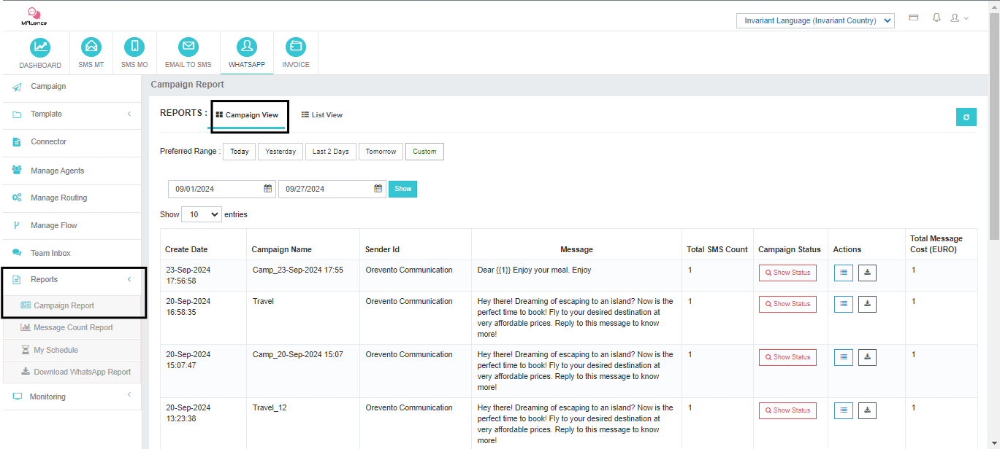

# Informe 1: Informe de la Campaña

El **Campaign Report** La sección ofrece dos opiniones para el seguimiento del desempeño de la campaña:

---

## Campaign View

- **Sinopsis:** Obtenga una vista de pájaro de sus campañas, incluyendo:
  - Nombre de la campaña 
  - Sender 
  - Índice 
  - Total de mensajes 
  - Situación 
  - Costo 

- **Análisis detallado:** Perforación en campañas específicas para:
  - Ver mensaje cuenta por estado (entregado, fallado, etc.) 
  - Descargar informes detallados 

---

## Lista Ver

- **Detalles del mensaje:** Dive profunda en el rendimiento individual del mensaje, incluyendo:
  - Número de destinatario 
  - Plantilla utilizada 
  - Fecha de presentación 
  - Fecha de entrega 
  - Situación 
  - Códigos de error 

